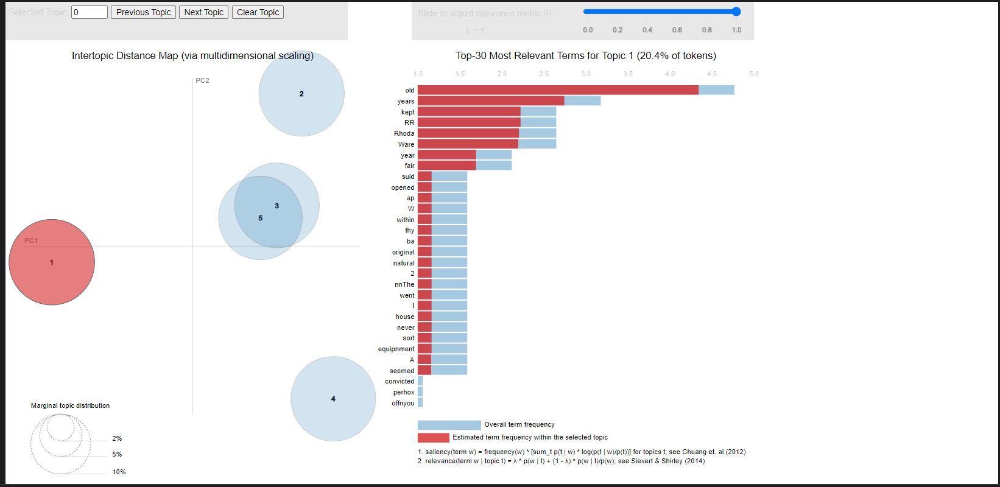

# Sentiment-Analysis

## Newspaper Digitization: Preserving History in the Digital Age

Newspaper digitization is the process of converting traditional printed newspapers into digital formats, making it easier to store, access, and search for information. This transformation not only helps preserve historical records but also enhances accessibility and research capabilities. 

# The Newspaper Digitization Process

## Selection and Preparation: 
The first step in the digitization process involves selecting the newspapers to be digitized and preparing them for scanning. This may include cleaning, repairing, and flattening the pages to ensure optimal image quality.

## Scanning: 
High-resolution scanners are used to create digital images of each newspaper page. There are various scanning technologies available, such as flatbed scanners for single pages or overhead scanners for bound volumes. The choice of scanner depends on factors like the size, condition, and binding of the newspapers.

## Optical Character Recognition (OCR):
 Once the pages are scanned, OCR software is used to convert the images into machine-readable text. This process identifies letters and words within the images, allowing for text searchability and indexing.

## Metadata Tagging:
 To further enhance searchability, metadata is added to the digitized newspapers. This may include information such as publication date, article titles, authors, and keywords. Metadata tagging enables users to search for specific topics or articles more efficiently.

## Quality Control and File Format Conversion:
 After OCR and metadata tagging, quality control checks are performed to identify any errors or inconsistencies. The digitized newspapers are then converted into various file formats, such as PDF or JPEG, for storage and distribution.

# Code Description

In this work, we have implemented LDA algorithm. Latent Dirichlet Allocation (LDA) is a generative probabilistic model for topic analysis in text documents. This unsupervised machine learning algorithm allows for the identification and classification of topics within a large collection of documents, such as digitized newspapers. In the context of newspaper digitization, LDA offers several benefits that can enhance the overall user experience and improve discoverability. For our research work, we have used 'Amhersburg Echo' as a corpus that is a collection of Amhersburg Echo newspaper from 1874 to 1932 . The Amherstburg Echo was a newspaper which served Amherstburg, Ontario from 1874 to 2012.

We have implemented LDA algorithm for topic modelling. Topic modeling is a natural language processing (NLP) technique used to discover hidden thematic structures in a large collection of text documents. 

## [1]  topic_modelling_by LDA.ipynb

In this code, we have implemented gensim library which is a free open-source Python library designed to process raw, unstructured digital texts. In order to clean our data, we have removed punctuation marks, stop words from our corpus. Then we have tokenized the cleaned texts. To do so, we have used word_tokenize module from nltk package. 

Here, we have displayed top 5 topics from our text. To visualize top topics, we have implemented pyLDAvis library.

